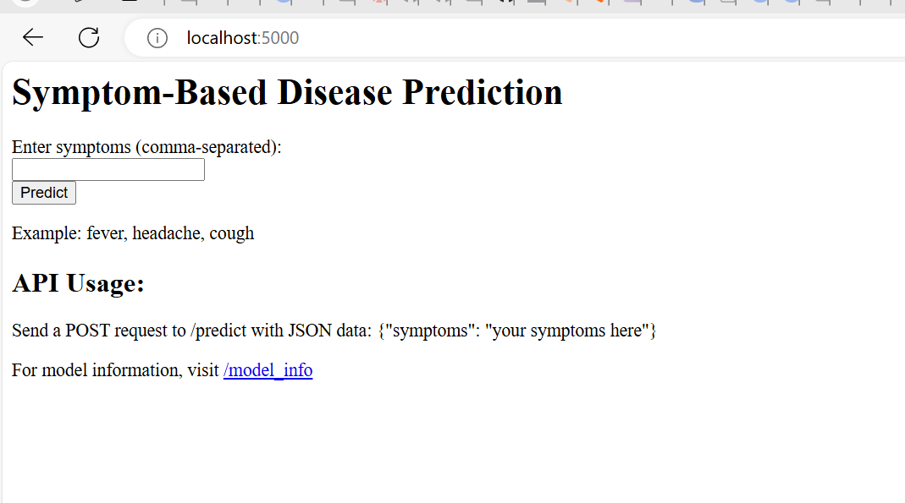

# SympCheck README

## Table of Contents
1. [Overview](#1-overview)
2. [Design Document](#2-design-document)
3. [Architecture Document](#3-architecture-document)
4. [Configuration](#4-configuration)
5. [Setup Instructions](#5-setup-instructions)
   - 5.1 [Prerequisites](#51-prerequisites)
   - 5.2 [Installation](#52-installation)
   - 5.3 [Run the Streamlit App](#53-run-the-streamlit-app)
6. [Usage](#6-usage)

## 1. Overview
SympCheck is a health diagnostic tool that identifies potential diseases based on user-provided symptoms. The project leverages natural language processing (NLP) techniques combined with a machine learning model to deliver accurate predictions through a user-friendly interface built with Streamlit.

## 2. Design document

Please refer to the [sympcheck design document](docs/development.md).

## 3. Architecture document

Please refer to the [sympcheck architecture Document](docs/architecture.md).

## 4. API Access

Here, you can access the API without setup in your local machine.

- **SympcheckBackend Production**: https://sympcheckbe-88b42835620c.herokuapp.com/
- **SympcheckBackend TestNet**: https://sympcheckbetestnet-fffc66f498ef.herokuapp.com/

Additionally, a streamlined test tool has been created to test the API without relying on third-party API client tools:


## 5. Setup Instructions

### 5.1 Prerequisites
- Python 3.7 or higher
- Flask 

### 5.2 Installation

- **Clone the Repository:**
```sh
git clone https://github.com/Venkatalakshmikottapalli/SympCheckBackend.git
cd SympCheckBackend
```
- **Install the Required Dependencies:**

```sh
pip install -r requirements.txt
```

### 5.4. Run the Flask API:
```sh
    python api\main.py 
```

## 6. Usage
After setting up, you can access the SympCheck API in your web browser at http://localhost:5000/.



Once you verify that API up and running then you can move on setup UI project

Follow the [Backend installation setup](https://github.com/Venkatalakshmikottapalli/SympCheck/blob/main/README.md)

